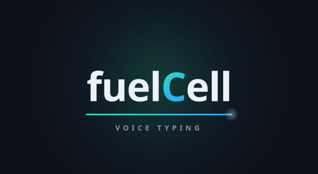
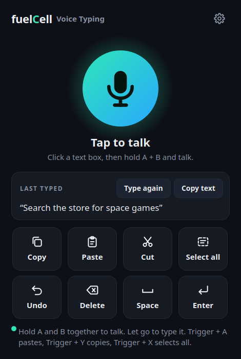
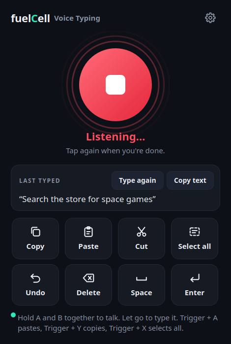
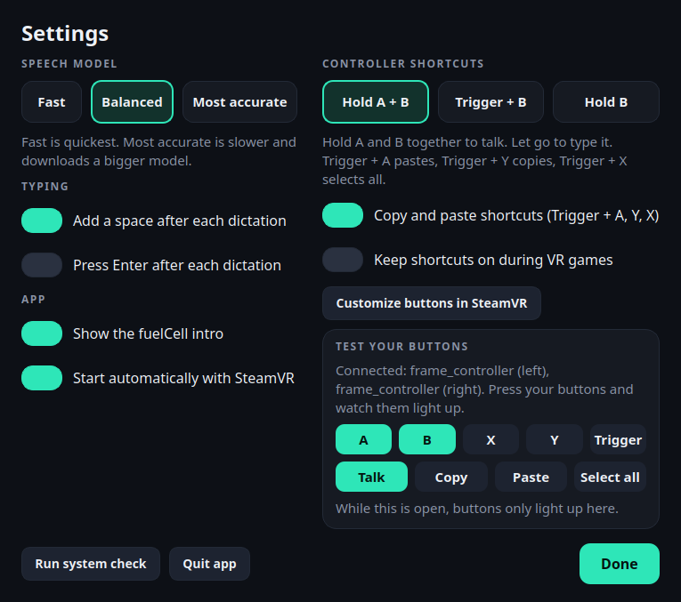

<p align="center"></p>

# fuelCell Voice Typing

Speak into any text box on your **Steam Frame**: the Steam store search, a browser, Discord. It also gives you easy **Copy, Paste and Select all** using your controllers.

- 🎙️ **Hold A + B, talk, let go.** Your words get typed wherever your cursor is, and are copied too.
- 📋 **Trigger + Y** copies, **Trigger + A** pastes, **Trigger + X** selects all.
- 🔒 **Free and private.** Speech recognition runs on the headset itself, with no account and nothing sent online.

<p align="center">
  
  
</p>

---

## Install (about 5 minutes)

You only do this once.

**1. Open the desktop on your Frame.** Switch the Frame to its Linux desktop (KDE) and open **Konsole**, the terminal app.

**2. Copy and paste this line into Konsole, then press Enter:**

```bash
curl -fsSL https://raw.githubusercontent.com/juanramosjr1/frame-voice/main/install.sh | bash && exec bash
```

The installer shows 5 steps and tells you when it's done. Running it again updates the app.

> **If it asks for a password:** voice typing needs permission to act like a keyboard. If you've never set a password, press `Ctrl+C`, type `passwd`, press Enter, choose a password, then run the line from step 2 again.

**3. Open fuelCell Voice Typing** from your apps. If the bottom of the window says the shortcuts need a SteamVR setting, tap **Turn on**. (That's SteamVR's **Enable global input from overlays** setting. It lets the app use your controller buttons while the Steam menu or the desktop is in front.)

**4. Restart the headset.** After that, the app starts on its own with SteamVR, in the background. Open it from your apps any time to see the window.

To make sure everything is set up, run this in Konsole:

```bash
~/.local/bin/frame-voice --check
```

(In a new Konsole window, `frame-voice --check` works too.)

---

## How to use it

| What you want | Controllers (default) | Or in the window |
| --- | --- | --- |
| Type with your voice | Click a text box, **hold A + B**, talk, let go | Tap the big mic, talk, tap again |
| Copy | **Trigger + Y** | Copy |
| Paste | **Trigger + A** | Paste |
| Select all | **Trigger + X** | Select all |
| Undo, Delete, Space, Enter | — | Buttons in the window |

A, B, X and Y are the buttons on the right controller. While you talk, a small **"Listening..."** badge floats below your view, so you don't need the window open. Every dictation is also copied, so you can paste it again anywhere.

**Tips**
- The controller is the best way to talk into the Steam UI: click the text box with the trigger, then hold A + B. Tapping the mic in the window works too, but in some places clicking the window moves the cursor away from your text box. If that happens, the app tells you and your words are copied, so click the text box and paste.
- While a VR game is running, the shortcuts are paused so the game keeps its buttons. They work again as soon as you open the Steam menu.
- Closing the window keeps the app running so the shortcuts keep working. Open the app again to bring the window back. Use **Settings > Quit app** to stop it.
- **Last typed** keeps your last sentence. Use **Type again** to retype it, or **Copy text** to put it on the clipboard.

## Change the shortcuts

Open **Settings** (the gear icon) and go to **Controller shortcuts**:

<p align="center"></p>

| Layout | Talk |
| --- | --- |
| **Hold A + B** (default) | Hold A and B together, talk, let go |
| **Trigger + B** | Hold the trigger and B, talk, let go |
| **Hold B** | Hold B, talk, let go |

In every layout, **Trigger + A** pastes, **Trigger + Y** copies and **Trigger + X** selects all. You can turn those off with **Copy and paste shortcuts**, and keep the shortcuts on during games with **Keep shortcuts on during VR games**.

**Test your buttons** shows each button light up as you press it, and what the combo does. While Settings is open, pressing buttons only lights them up there.

If you want different buttons, tap **Customize buttons in SteamVR**. That opens SteamVR's controller bindings screen for this app, where each of the app's buttons (A, B, X, Y, Trigger) can be moved to any button you like. If it doesn't open, go to **SteamVR Settings > Controllers > Manage Controller Bindings** and pick **fuelCell Voice Typing**.

Settings also has: speech model (**Fast / Balanced / Most accurate**, picked once and used every time), add a space after each dictation, press Enter after each dictation, show the intro, and start automatically with SteamVR.

---

## Troubleshooting

| Problem | Fix |
| --- | --- |
| Nothing gets typed | Click the text box with the controller first, then hold A + B. If it still doesn't work, run `~/.local/bin/frame-voice --check`. If "Can type into apps" says FIX, run the installer again and restart. |
| Controller shortcuts do nothing | Open **Settings** and look at **Test your buttons**. If it says a SteamVR setting is needed, tap **Turn on** (or in SteamVR, show Advanced Settings, then **Developer > Enable global input from overlays**), then restart the headset. The dot at the bottom of the window is green when shortcuts are on. |
| Shortcuts stop during a game | That's on purpose, so the game keeps its buttons. Open the Steam menu, or turn on **Keep shortcuts on during VR games**. |
| `frame-voice: command not found` | Open a new Konsole window, or use the full path: `~/.local/bin/frame-voice --check`. |
| "Didn't catch that" | Speak a little closer or longer, or try **Most accurate** in Settings. |
| Typing is slow to start | Use **Fast** in Settings. |
| Wrong characters | The app types as a US keyboard layout. |

## Uninstall

```bash
bash ~/.local/share/frame-voice/uninstall.sh
```

---

## How it works (for the curious)

- **Speech to text:** [faster-whisper](https://github.com/SYSTRAN/faster-whisper), running locally on the headset's ARM CPU.
- **Typing:** a virtual USB keyboard made through Linux `uinput`, so anything that accepts a real keyboard accepts it, including the Steam client. Written in pure Python with nothing to compile.
- **Controller shortcuts:** SteamVR Input, with each button in its own action set (the approach Frame overlay apps such as [Frametop](https://github.com/DeeJanuz/frametop) use), so the app only takes the buttons it needs: A, B, X and Y, plus the trigger only while one of those is held. Combos are worked out by the app. Default bindings for the Steam Frame controllers (`frame_controller`), plus Quest/Touch and Index. A read-only second source (SteamVR's own controller binding page, adapted from Frametop) keeps them working if the SteamVR setting is off. The app uses Valve's official Linux ARM64 OpenVR library.
- **Window:** Qt (PySide6). On KDE the app adds a window rule so its window never takes keyboard focus, so pressing its buttons leaves your cursor in the text box, the same way an on-screen keyboard works. The window also ignores typed keys, so text can never trigger its buttons.

### Testing

Every push runs the full test suite on GitHub on both **x86 and ARM64** Linux. It runs the real installer, types through a real virtual keyboard and checks the key presses arrive, has Whisper transcribe a synthesized sentence, and drives the controller logic frame by frame against a stand-in for SteamVR.

Not yet verified on a real Steam Frame:
- typing into the Steam store inside the SteamVR dashboard
- controller shortcuts with this version (button names are from Valve's Steam Frame docs)

If something doesn't work, run `~/.local/bin/frame-voice --check` and share the output.

### Development

```bash
python3 -m venv .venv && . .venv/bin/activate
pip install -e '.[test]'
QT_QPA_PLATFORM=offscreen pytest
```

MIT licensed. Made by fuelCell.
